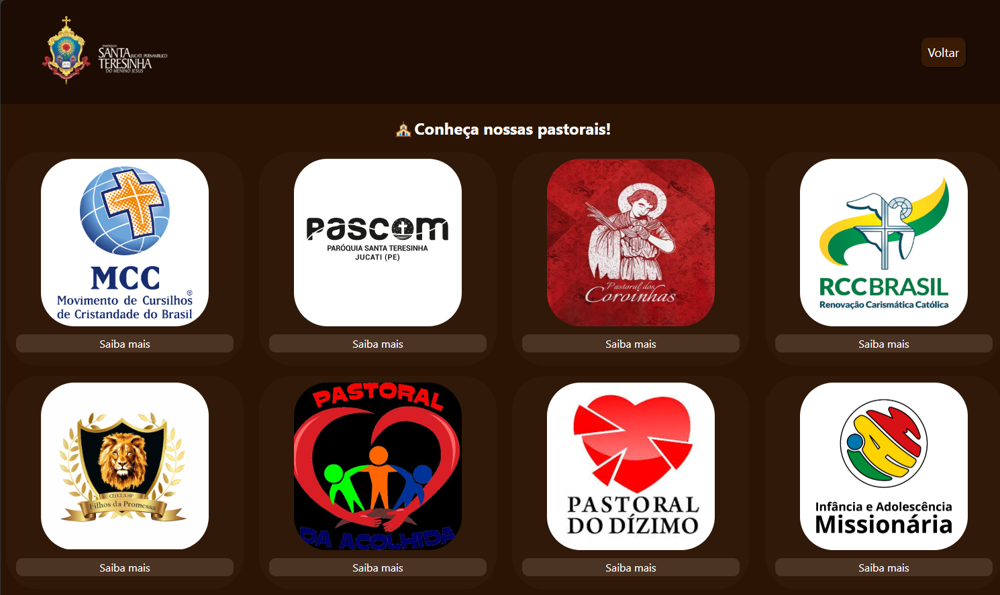
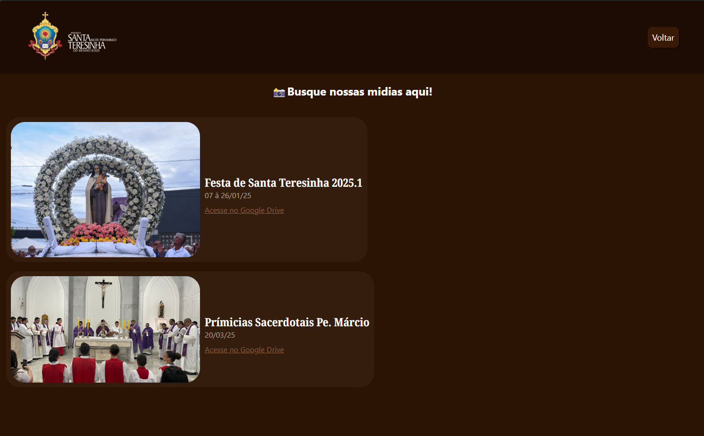

# 📌 Site da PASCOM - Paróquia Santa Teresinha do Menino Jesus

Este é um site desenvolvido para a Pastoral da Comunicação (PASCOM) da Paróquia Santa Teresinha do Menino Jesus. O objetivo é divulgar informações da comunidade, eventos, e fortalecer a presença online da paróquia.

## 🌐 Acesse o site

🔗 [Clique aqui para ver o site publicado](https://site-paroquia.vercel.app/index.html)

---

## 🛠️ Tecnologias utilizadas

- HTML5
- CSS3
- Git e GitHub
- GitHub Pages (hospedagem gratuita)

---

## 🎯 Funcionalidades atuais

- Página inicial com informações da paróquia
- Galeria de imagens
- Menu de navegação
- Design leve e responsivo (em desenvolvimento)

---

## 🖼️ Visual do Site

### 📍 Página Inicial

### 🙏 Página de Pastorais

### 📺 Página de Mídias

---

## 💡 Próximas melhorias

- Aprimorar a responsividade para dispositivos móveis
- Aplicar Tailwind CSS para estilização moderna
- Melhorar acessibilidade e semântica
- Adicionar uma página de eventos e formulário de contato

---

## 👨‍💻 Desenvolvedor

- **Alysson Felipe Matias da Silva**  
  Aluno do 4º ano de TI no IFPE  
  [GitHub](https://github.com/alysson0321)

---
